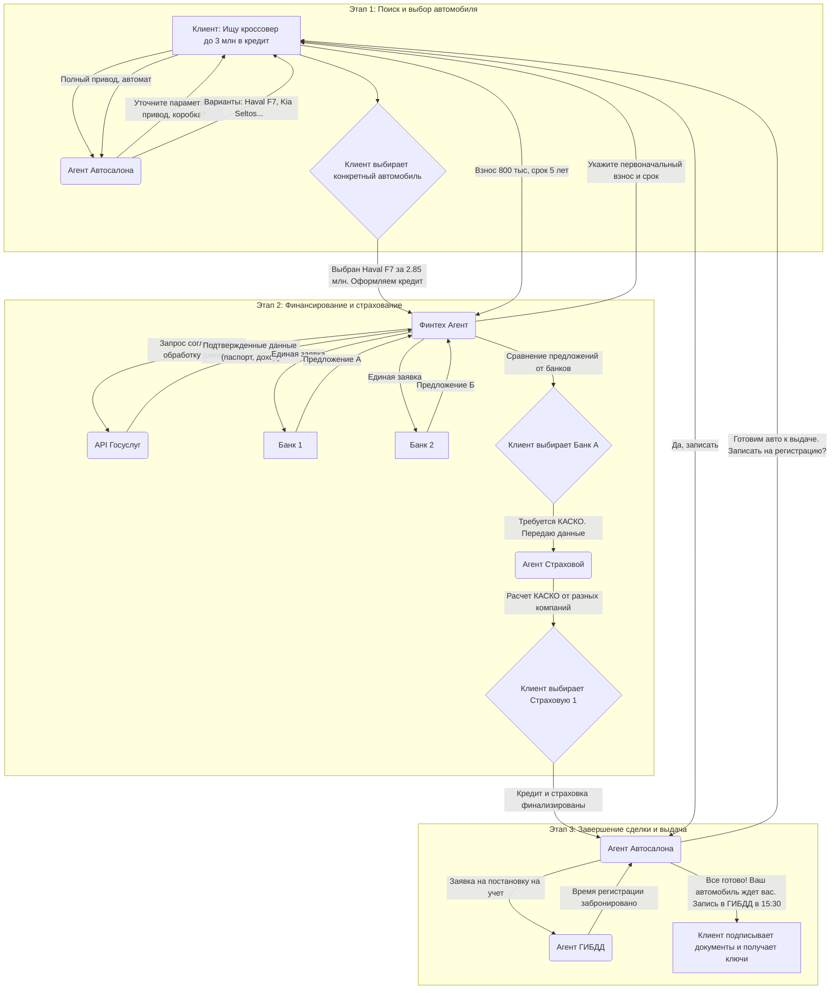

### **Полный процесс покупки автомобиля через систему ИИ-агентов**

Представьте, что вы открываете городской чат-ассистент (назовем его "Мой Ижевск") и решаете купить автомобиль. Весь сложный путь от неопределенного желания до получения ключей будет выглядеть так:

---

### **Этап 1: Выбор и инициация**

**Шаг 1. Начало диалога и поиск.**
Вы начинаете диалог с общей фразы. Вам не нужно знать, к какому именно дилеру обращаться.
* **Вы:** `Привет, хочу купить новый кроссовер в пределах 3 миллионов рублей в кредит.`
* **Система (активируется Агент Автосалона):** `Добрый день! Рад помочь с выбором. Уточните, пожалуйста, есть ли предпочтения по марке? Возможно, важны какие-то опции: полный привод, автоматическая коробка, большой багажник?`

**Шаг 2. Уточнение и подбор вариантов.**
Вы сужаете критерии поиска, а агент мгновенно обрабатывает ваш запрос, проверяя наличие автомобилей у всех дилеров города, подключенных к системе.
* **Вы:** `Интересует что-то с полным приводом и автоматом. Желательно китайского или корейского производства.`
* **Агент Автосалона:** `Понял вас. По вашим критериям в наличии есть:`
    1.  `Haval F7 (полный привод, робот) - 2 850 000 ₽. Есть в белом и сером цвете.`
    2.  `Geely Coolray (передний привод, но очень популярен) - 2 700 000 ₽.`
    3.  `Kia Seltos (полный привод, автомат, 2024 г.в.) - 3 100 000 ₽. Остался один в синем цвете.`
    `Могу показать фото, комплектации и отзывы по каждой модели.`

**Шаг 3. Финальный выбор и подтверждение.**
Вы изучаете предложенные варианты, возможно, задаете дополнительные вопросы ("А какой расход у Haval?"), и наконец, делаете выбор.
* **Вы:** `Отлично, мне нравится Haval F7 в белом цвете. Давайте его. Готов оформлять в кредит.`
* **Агент Автосалона:** `Прекрасный выбор! Цена автомобиля — 2 850 000 ₽. Подтверждаете? Как только вы скажете "да", я передам всю информацию нашему финансовому помощнику для расчета кредита.`
* **Вы:** `Да, подтверждаю.`

---

### **Этап 2: Финансирование и страхование**

**Шаг 4. Бесшовный переход к кредитованию.**
Диалог в том же окне продолжает другой, специализированный агент. Вам не нужно заново объяснять, что вы покупаете.
* **Агент Автосалона:** `Передаю слово Финтех Агенту.`
* **Финтех Агент:** `Здравствуйте! Я ваш кредитный помощник. Вижу, вы выбрали Haval F7 за 2 850 000 ₽. Чтобы я мог подобрать лучшие условия, укажите, пожалуйста, сумму первоначального взноса и желаемый срок кредита.`
* **Вы:** `Первый взнос 800 000 ₽, срок — 5 лет.`

**Шаг 5. Единая заявка и получение предложений.**
Это ключевой момент синергии. Вместо того чтобы заполнять 5 анкет для 5 банков, вы даете одно согласие.
* **Финтех Агент:** `Спасибо. Сумма кредита: 2 050 000 ₽. Я могу отправить единую заявку в наши банки-партнеры (Банк А, Банк Б, Банк В и др.), чтобы получить для вас реальные, а не рекламные ставки. Для этого мне нужно подтверждение вашей личности и дохода. Удобнее всего сделать это через Госуслуги. Разрешаете?`
* **Вы:** (нажимаете кнопку "Разрешить через Госуслуги" и подтверждаете вход в приложении).
* **Финтех Агент:** `Отлично, заявка отправлена. Обычно банки отвечают в течение 5-15 минут. Пожалуйста, подождите.`

**Шаг 6. Сравнение и выбор лучшего предложения.**
Агент собирает ответы и представляет их в простом и понятном виде.
* **Финтех Агент:** `Получены одобрения от трех банков. Вот сравнение на 5 лет:`
    * **Банк А:** Ставка 11.9%, ежемесячный платеж **45 300 ₽**.
    * **Банк Б:** Ставка 12.5%, ежемесячный платеж **45 950 ₽**.
    * **Банк В:** Отказ.
    `Рекомендую выбрать Банк А. Вы согласны?`
* **Вы:** `Да, Банк А подходит.`

**ШаГ 7. Интеграция со страхованием.**
Кредит на новый автомобиль невозможен без полиса КАСКО. Система тут же решает и эту задачу.
* **Финтех Агент:** `Принято. Для этого кредита необходимо оформить КАСКО. Передаю данные в страховой сервис.`
* **Агент Страховой:** `Здравствуйте! На основе данных об автомобиле и водителе (стаж и возраст я получил с вашего согласия через базу РСА) я рассчитал стоимость КАСКО:`
    * `Страховая Компания 1: 95 000 ₽.`
    * `Страховая Компания 2: 102 000 ₽.`
    `Стоимость полиса можно включить в тело кредита. Включаем полис от Компании 1?`
* **Вы:** `Да, включайте.`

---

### **Этап 3: Завершение сделки**

**Шаг 8. Финальное одобрение и подготовка к выдаче.**
Все части головоломки сходятся.
* **Финтех Агент:** `Все готово. Кредитный договор и полис сформированы. Общая сумма кредита с учетом КАСКО — 2 145 000 ₽. Документы отправлены в автосалон. Передаю слово менеджеру.`
* **Агент Автосалона:** `Поздравляю! Денежные средства от Банка А поступили. Ваш Haval F7 проходит предпродажную подготовку. Мы можем выдать его вам уже завтра.`

**Шаг 9. Регистрация в ГИБДД.**
Система берет на себя еще одну рутинную задачу.
* **Агент Автосалона:** `Мы также можем помочь с регистрацией автомобиля. Я могу передать данные в ГИБДД и записать вас на получение номеров. Удобное время для визита?`
* **Вы:** `Да, отлично. Завтра после 15:00.`
* **Агент ГИБДД (в том же чате):** `Запись на регистрацию ТС по адресу ул. Воткинское шоссе, 120 подтверждена на завтра, 15:30. Госпошлина составит 2850 ₽. Оплатить можно здесь.` (появляется кнопка оплаты).

**Шаг 10. Получение автомобиля.**
Финал процесса.
* **Агент Автосалона:** `Итак, все готово. Ждем вас завтра в нашем салоне на ул. Ленина в 14:00 для подписания оригиналов документов и получения ключей. В 15:30 вас будут ждать в ГИБДД для получения номеров. Построить маршрут?`
* **Вы:** `Да, спасибо!`
* **Система:** (присылает карту с маршрутом от автосалона до ГИБДД).

Таким образом, разрозненный и нервный процесс превратился в логичный и спокойный диалог с одним умным ассистентом.

