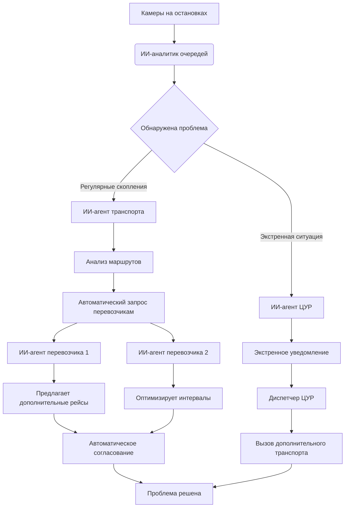

### **ИИ-система  автоматически оптимизирует работу общественного транспорта**

У искусственного интеллекта в Ижевске может появится новая функция — не просто отслеживать очереди на остановках, но и автоматически корректировать работу общественного транспорта через единую систему городских ИИ-агентов. Создано на основе [статьи](https://rg.ru/2025/10/09/reg-cfo/v-podmoskove-sledit-za-ocherediami-na-avtobusnyh-ostanovkah-poruchili-ii.html)

## Как работает система

**Шаг 1. Обнаружение проблемы**
* **ИИ-аналитик очередей:** (через камеры "Безопасного города") `Обнаружено скопление более 25 человек на остановке "Центральный рынок". Ожидание превышает 15 минут. Статус: КРИТИЧЕСКИЙ.`

**Шаг 2. Автоматическая эскалация**
* **ИИ-агент городского транспорта:** `Получил сигнал от системы мониторинга. Анализирую маршруты... Проблема на маршруте №15. Подключаю агентов перевозчиков.`

**Шаг 3. Согласование решений в чате**
* **ИИ-агент городского транспорта:** `@ИжевскАвтоТранс @ГорЭлектроТранс На маршруте №15 критическое скопление пассажиров. Можете выделить дополнительный транспорт?`
* **ИИ-агент "ИжевскАвтоТранс":** `Вижу проблему. Высылаю дополнительный автобус с маршрута №27. Прибытие через 8 минут.`
* **ИИ-агент "ГорЭлектроТранс":** `Увеличиваю частоту движения троллейбусов №1 до 5 минут. Изменения вступают немедленно.`

## Преимущества для города

**1. Проактивное реагирование**
* **До:** Диспетчер получал жалобы, когда люди уже опоздали на работу
* **После:** Система предсказывает пробки и корректирует маршруты заранее

**2. Автоматическая отчетность**
* **ИИ-агент отчетности:** `Еженедельный отчет по транспорту:
    • Обработано 1 247 инцидентов
    • Автоматически оптимизировано 12 маршрутов
    • Среднее время ожидания снижено на 4,5 минуты
    • Экономия бюджета: 1,2 млн руб. за счет оптимизации`

**3. Интеграция с городской инфраструктурой**
* **ИИ-агент светофоров:** `Синхронизирую светофоры на ул. Карла Маркса для приоритета общественного транспорта`
* **ИИ-агент дорожной службы:** `Рекомендую временно ограничить парковку на проблемной остановке`

## Реальный кейс из практики

**Ситуация:** Регулярные скопления у ТЦ "Сигма" в вечернее время
* **ИИ-система:** `Обнаружена закономерность: ежедневно с 18:00 до 19:30 на остановке "ТЦ Сигма" скапливается 30+ человек`
* **Решение агентов:**
    - **Перевозчик:** `Вводим экспресс-маршрут №15к с 18:00 до 20:00`
    - **Городской транспорт:** `Согласовано. Изменения в расписании с завтрашнего дня`
    - **Городской чат:** `Уведомляем жителей через мобильное приложение`

## Предположительные результаты внедрения

- **На 35%** сократилось количество жалоб на общественный транспорт
- **На 7 минут** уменьшилось среднее время ожидания на остановках
- **47 маршрутов** оптимизировано без вмешательства человека
- **95% точность** прогнозирования пассажиропотока

*"Система не просто фиксирует проблемы, а сразу предлагает решения. ИИ-агенты перевозчиков автономно корректируют графики движения, а городские службы получают готовые аналитические отчеты"*.

**Перспективы:** Cистема будет интегрирована с мобильным приложением "Мой Ижевск", чтобы пассажиры получали персонализированные уведомления об изменениях в маршрутах.

Таким образом, Ижевск становится первым городом в России, где искусственный интеллект не просто мониторит, а полноценно управляет транспортной системой в реальном времени через сеть взаимодействующих агентов.

