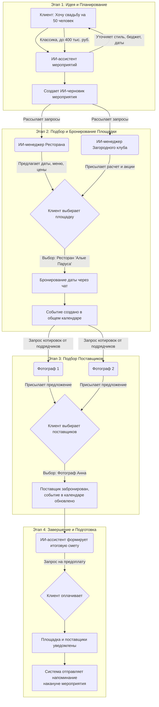

### **Процесс организации мероприятия через систему ИИ-агентов**

Представьте, что вы открываете городской чат-ассистент («Мой Ижевск») и хотите организовать мероприятие. Весь путь от идеи до праздника будет выглядеть как единый, управляемый диалог.

---

### **Этап 1: Идея и планирование**

**Шаг 1. Начало диалога и сбор пожеланий.**
Вы начинаете диалог с общей идеей. Система активирует **ИИ-ассистента по мероприятиям**.
*   **Вы:** `Здравствуйте, хочу организовать свадьбу на 50 человек в конце августа.`
*   **ИИ-ассистент:** `Поздравляю с предстоящим событием! Рад помочь в организации. Давайте составим предварительный план. Уточните, пожалуйста, есть ли предпочтения по стилю мероприятия (классика, бохо, современный)? И какой бюджет вы рассматриваете?`

**Шаг 2. Создание черновика мероприятия с помощью ИИ.**
На основе ваших ответов ассистент создает структурированный черновик, который станет основой для коммуникации.
*   **Вы:** `Стиль — классический, бюджет до 400 000 рублей.`
*   **ИИ-ассистент:** `Отлично! Я создал черновик вашего мероприятия "Свадьба" с указанием стиля, бюджета и количества гостей. Теперь я могу помочь подобрать площадку (venue) и других подрядчиков. Разрешите отправить запросы от вашего имени?`
*   **Вы:** `Да, конечно.`

---

### **Этап 2: Подбор площадки и бронирование даты**

**Шаг 3. Бесшовный переход к подбору площадки.**
Ассистент действует как ваш персональный менеджер, взаимодействуя с агентами площадок.
*   **ИИ-ассистент:** `Передаю запрос агентам проверенных площадок города.`
*   (В фоновом режиме ассистент рассылает сформированный ИИ-черновик **ИИ-менеджерам площадок**).
*   **ИИ-менеджер Ресторана "Алые Паруса":** (появляется в общем чате) `Здравствуйте! Вижу ваш запрос на свадьбу на 50 человек в классическом стиле. У нас есть свободные даты 24, 25 и 31 августа. Присылаю вам наше базовое меню и цены. Также можем предложить пакет "Все включено" с декором и ведущим.`
*   **ИИ-менеджер Загородного Клуба "Лесная":** `Добрый день! Наша площадка идеально подходит для классической свадьбы. На 31 августа действует акция. Запросили для вас расчет стоимости.`

**Шаг 4. Проверка дат и бронирование через ИИ-чат.**
Вы изучаете предложения и выбираете понравившийся вариант. Бронирование происходит прямо в чате.
*   **Вы:** `Мне нравится "Алые Паруса" на 25 августа. Можно забронировать?`
*   **ИИ-ассистент:** `Конечно. Связываюсь с менеджером для подтверждения даты.`
*   **ИИ-менеджер Ресторана "Алые Паруса":** `Дата 25 августа свободна! Согласно нашей политике, я могу забронировать ее за вами на 14 дней без предоплаты. Для этого нужно создать событие в нашем общем календаре. Вы согласны?`
*   **Вы:** `Согласен.`
*   **Система:** `Событие "Свадьба - Ресторан "Алые Паруса"" создано в календаре. Все участники (вы, ресторан) видят его.`

---

### **Этап 3: Подбор поставщиков и согласование деталей**

**Шаг 5. Запрос котировок и бронирование подрядчиков.**
Система помогает найти других участников праздника.
*   **ИИ-ассистент:** `Отлично, площадка забронирована! Нужно ли подобрать фотографа, ведущего, декоратора? Я могу отправить им запрос с котировкой на основе вашего черновика.`
*   **Вы:** `Да, подберите топ-3 фотографов в классическом стиле.`
*   **ИИ-ассистент:** (рассылает запросы поставщикам из базы).
*   **Фотограф Анна:** (в чате) `Приветствую! Получила ваш бриф. Готова предложить пакет на 8 часов съемки с обработкой 300 фото за 40 000 руб. Мое портфолио по ссылке.`
*   **Фотограф Иван:** `Мой пакет на свадьбу — 35 000 руб. Включаю предсвадебную прогулку.`
*   **Вы:** (изучая портфолио) `Выбираю Анну.`
*   **ИИ-ассистент:** `Принято. Анна, подтверждаете бронь на 25 августа?`
*   **Фотограф Анна:** `Подтверждаю. Добавляю событие в календарь.`
*   **Система:** `Событие в календаре обновлено. Добавлен участник "Фотограф Анна".`

**Шаг 6. Согласование меню и деталей с площадкой.**
ИИ-ассистент помогает уточнить детали с уже забронированной площадкой.
*   **Вы:** `Можем ли мы обсудить меню с рестораном? Хочу убрать рыбу и добавить больше салатов.`
*   **ИИ-ассистент:** `Конечно. Инициирую чат с менеджером ресторана для согласования меню.`
*   **ИИ-менеджер Ресторана "Алые Паруса":** `Получил ваши пожелания. Присылаю обновленное меню и итоговый расчет. Стоимость немного снизилась. Все ли верно?`
*   **Вы:** `Да, все верно.`

---

### **Этап 4: Финальное подтверждение и подготовка**

**Шаг 7. Сводка и предоплата.**
Когда все ключевые поставщики выбраны, система формирует финальную сводку.
*   **ИИ-ассистент:** `Я вижу, что все основные поставщики забронированы. Вот итоговая смета:`
    *   *Ресторан "Алые Паруса" (аренда, меню, обслуживание): 300 000 руб.*
    *   *Фотограф Анна: 40 000 руб.*
    *   *Ведущий (забронирован ранее): 25 000 руб.*
    *   **Итого: 365 000 руб.**
    `Для подтверждения брони ресторана требуется предоплата 30%. Вы можете оплатить ее безопасным платежом через платформу.`
*   **Вы:** (нажимает кнопку "Оплатить предоплату").
*   **Система:** `Платеж принят. Ресторан уведомлен.`

**Шаг 8. Финальные напоминания.**
За несколько дней до мероприятия система присылает напоминания.
*   **ИИ-ассистент:** `До вашей свадьбы осталось 3 дня! Напоминаю, что 25 августа в 16:00 в Ресторане "Алые Паруса". Все участники мероприятия подтвердили свою готовность. Хорошего праздника!`

Таким образом, сложный процесс организации, требующий общения с десятком подрядчиков, превращается в четкий, структурированный и спокойный диалог, где за вас работают умные агенты.

