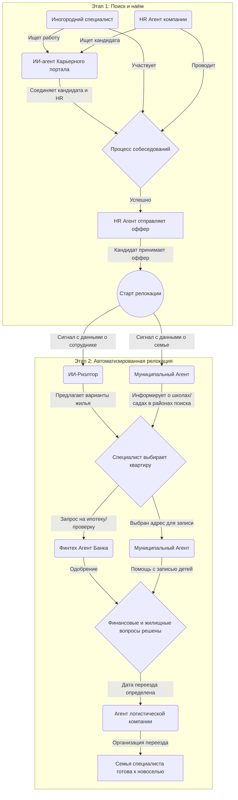

### Сценарий: От поиска работы до новоселья в Ижевске — комплексный путь в едином чате

Этот сценарий демонстрирует, как иногородний специалист проходит полный цикл от отклика на вакансию до обустройства в Ижевске, взаимодействуя с городом через единый чат ИИ-агентов. Система превращает разрозненные процессы в бесшовный и поддерживающий опыт.

**Новые и существующие участники:**

*   **ИИ-агент Карьерного портала:** Агрегирует вакансии, анализирует резюме и инициирует первый контакт.
*   **HR-агент компании:** Ведет процесс найма и запускает протокол релокации.
*   **ИИ-риэлтор:** Подбирает жилье.
*   **Финтех-агент банка:** Помогает с финансовыми вопросами (аренда, ипотека).
*   **Муниципальный агент:** Консультирует по школам, детским садам и городским услугам.
*   **Сервис-агент (логистика):** Организует переезд.
*   **Специалист (кандидат):** Главное действующее лицо, ищущее новые карьерные возможности.

---

**Пошаговое взаимодействие в едином городском чате:**

**Шаг 1: Поиск работы и первый контакт**

Процесс может начаться двумя путями:

*   **Вариант А: Специалист ищет работу.** Специалист из другого города размещает свое резюме на крупном карьерном портале, интегрированном с городской системой Ижевска. **ИИ-агент Карьерного портала** анализирует его профиль, навыки и опыт. Обнаружив совпадение с вакансией ижевской компании, агент отправляет специалисту персонализированное предложение в чат: *"Здравствуйте, [Имя]! Я карьерный ассистент города Ижевск. У нас есть вакансия [Название вакансии] в компании [Название компании], которая идеально соответствует вашему опыту. Интересно узнать подробности?"*
*   **Вариант Б: HR-агент ищет кандидата.** **HR-агент** ижевской компании ищет специалистов по всей стране через HH. Он находит резюме подходящего кандидата и через систему отправляет ему приглашение на диалог.

**Шаг 2: Процесс найма и получение оффера**

Специалист выражает заинтересованность. **ИИ-агент Карьерного портала** передает диалог напрямую **HR-агенту** компании. В этом же чате происходит дальнейшее общение: назначаются онлайн-собеседования, обсуждаются условия.

Ключевой момент наступает, когда компания готова сделать предложение. **HR-агент** отправляет официальный оффер (предложение о работе) прямо в чат. В сообщении с оффером есть кнопка "Принять предложение и запустить помощь в переезде".

**Шаг 3: Активация протокола релокации**

Специалист нажимает кнопку "Принять". Это действие служит сигналом для всей экосистемы городских ИИ-агентов. **HR-агент** отправляет в систему команду, которая запускает комплексный процесс помощи в переезде. В чате появляется системное сообщение: *"Поздравляем с новой работой! Мы поможем сделать ваш переезд в Ижевск максимально комфортным. К диалогу подключаются ваши персональные помощники: риэлтор, муниципальный консультант и другие."*

**Шаг 4: Комплексное решение бытовых вопросов**

Сразу после активации протокола в работу включаются несколько агентов, действующих параллельно:

*   **ИИ-риэлтор** получает от HR-агента базовые данные (состав семьи, предпочтения, район работы) и тут же предлагает первые варианты жилья, запрашивая у специалиста уточнения.
*   **Муниципальный агент** предоставляет приветственную информацию о городе и, зная о наличии детей, присылает данные о лучших школах и детских садах в районах, где ищется жилье. Он готов в любой момент помочь с подачей заявления.
*   **Финтех-агент** находится в режиме ожидания. Как только специалист выбирает квартиру для аренды или покупки, риэлтор передает ему сигнал, и он помогает быстро пройти проверку для договора или получить предварительное одобрение ипотеки.

**Шаг 5: Организация переезда и финальные шаги**

Когда жилье выбрано, а финансовые вопросы урегулированы, система автоматически переходит к логистике. **ИИ-риэлтор** передает данные о дате переезда и адресах **Сервис-агенту**, который предлагает проверенные транспортные компании и помогает организовать перевозку вещей.

**Итог: Бесшовный опыт от кандидата до жителя**

Такой сценарий создает уникальный и целостный опыт. Специалист чувствует поддержку и заботу со стороны города и работодателя с самого первого контакта. Процесс, который раньше был источником стресса и неопределенности (поиск работы, переговоры, поиск жилья, устройство детей, переезд), теперь выглядит как хорошо организованный проект, управляемый из одного окна. Это становится мощным конкурентным преимуществом для Ижевска в борьбе за привлечение высококвалифицированных кадров со всей страны.

