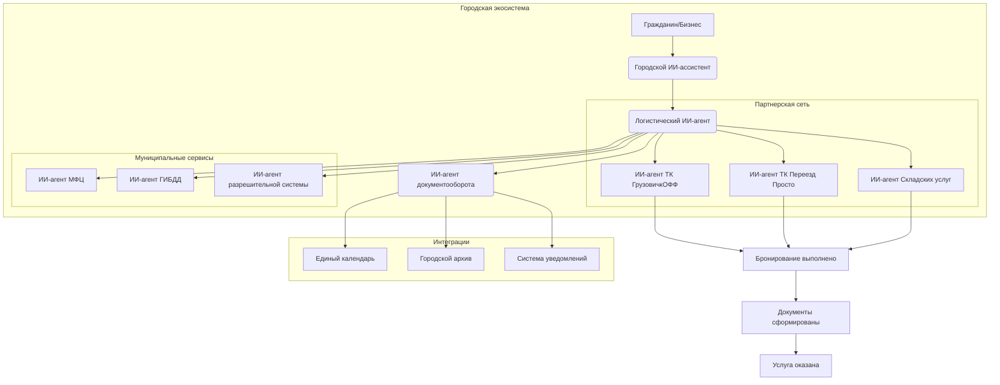

### **Процесс оформления грузоперевозки**

**Участники системы:**
- **Гражданин/Бизнес** - инициатор перевозки
- **Городской ИИ-ассистент** - центральный координатор
- **Логистический ИИ-агент** - специализированный помощник по перевозкам
- **ИИ-агенты транспортных компаний** - подключенные перевозчики города
- **ИИ-агент документооборота** - обработка и генерация документов

---

### **Этап 1: Инициация запроса через городской чат**

**Шаг 1. Начало диалога с городским ассистентом**
* **Гражданин:** `Нужно перевезти мебель из старой квартиры в новую. Переезжаем в новый район.`
* **Городской ИИ-ассистент:** `Понял вас! Помогу организовать переезд. Подключаю логистического помощника.`

**Шаг 2. Автоматическое подключение логистического агента**
* **Логистический ИИ-агент:** `Здравствуйте! Я ваш помощник по перевозкам. Расскажите подробнее:
    • Откуда и куда переезжаем (точные адреса)?
    • Какой объем груза (сколько комнат, есть ли крупная техника)?
    • Когда планируете переезд?`

---

### **Этап 2: Детализация и подбор перевозчиков**

**Шаг 3. Сбор информации и анализ потребностей**
* **Гражданин:** `От ул. Ленина, 15 до ул. Советская, 42. Двухкомнатная квартира, есть холодильник, стиральная машина. Хотели бы в субботу.`
* **Логистический ИИ-агент:** `Спасибо! Анализирую ваши потребности... Подбираю проверенных перевозчиков в Ижевске.`

**Шаг 4. Интеграция с транспортными компаниями города**
* **Логистический ИИ-агент:** (в фоновом режиме рассылает запросы агентам транспортных компаний)
* **ИИ-агент "ГрузовичкОФФ":** (появляется в чате) `Здравствуйте! Можем предложить грузовую "ГАЗель" с двумя грузчиками в эту субботу. Стоимость: 3500 руб./час, минимальный заказ 3 часа.`
* **ИИ-агент "Переезд Просто":** `Добрый день! У нас есть акция "Переезд под ключ" - 12 000 руб. включая упаковочные материалы. Время не ограничено.`

---

### **Этап 3: Бронирование и оформление через ИИ**

**Шаг 5. Выбор и бронирование услуги**
* **Гражданин:** `Выбираю "Переезд Просто" за 12 000 рублей.`
* **Логистический ИИ-агент:** `Отлично! Бронирую переезд на субботу. Подключаю документооборот.`

**Шаг 6. Автоматическое оформление документов**
* **ИИ-агент документооборота:** `Формирую пакет документов:
    • Договор оказания услуг
    • Акт приема-передачи имущества
    • Счет на оплату
    Все документы подписаны усиленной квалифицированной электронной подписью системы.`

---

### **Этап 4: Комплексное обслуживание**

**Шаг 7. Интеграция со смежными сервисами**
* **Городской ИИ-ассистент:** `Кстати, для нового адреса могу помочь:
    • Прописать в квартире через МФЦ
    • Оформить льготу по ЖКХ
    • Записать ребенка в ближайшую школу
    Нужна помощь с чем-то из этого?`

**Шаг 8. Управление через единый календарь**
* **Логистический ИИ-агент:** `Переезд добавлен в ваш городской календарь на субботу. За день до события напомним и отправим контакты экипажа.`

---

### **Корпоративный сценарий: Перевозка товара для бизнеса**

**Шаг 1. Бизнес-запрос**
* **Предприниматель:** `Нужно доставить партию товара из нашего склада в магазины по городу. Регулярные поставки.`
* **Городской ИИ-ассистент:** `Подключаю бизнес-логистику. У нас есть система регулярных маршрутов.`

**Шаг 2. Анализ и оптимизация маршрутов**
* **Логистический ИИ-агент:** `Проанализировал ваши магазины. Предлагаю оптимизированный маршрут:
    • Пн-Пт: центральные районы
    • Ср-Чт: отдаленные точки
    Экономия до 30% на логистике.`

**Шаг 3. Интеграция с городской инфраструктурой**
* **Логистический ИИ-агент:** `Согласовал с муниципальными службами:
    • Специальные окна для разгрузки в центре
    • Разрешение на парковку в нерабочие часы
    Все включено в стоимость.`

---

### **Этап 5: Контроль и отчетность**

**Шаг 9. Трекинг и уведомления**
* **Городской ИИ-ассистент:** `Ваш груз в пути. Ожидаемая прибытие через 25 минут. Водитель Иван, номер машины А123ВС18.`

**Шаг 10. Автоматическая отчетность**
* **ИИ-агент документооборота:** `Перевозка завершена! Сформированы:
    • Акт выполненных работ
    • Закрывающие документы для бухгалтерии
    • Квитанция об оплате
    Все документы сохранены в вашем городском архиве.`

---

### **Преимущества интеграции в городской чат:**

1. **Единая точка входа** - все городские услуги в одном месте
2. **Сквозная автоматизация** - от запроса до закрывающих документов
3. **Интеграция с инфраструктурой** - согласование с городскими службами
4. **Умная маршрутизация** - оптимизация с учетом городской логистики
5. **Прозрачность** - все участники процесса в одном чате
6. **Безопасность** - все данные хранятся в защищенной городской системе

**Пример завершения диалога:**
* **Гражданин:** `Спасибо! Все прошло идеально.`
* **Городской ИИ-ассистент:** `Рад был помочь! В городском календаре создано напоминание о следующем ТО для вашей стиральной машины через 6 месяцев. Хорошего дня в вашем новом доме! 🏠`

Такая интеграция превращает разрозненные логистические услуги в часть комплексной городской экосистемы, где каждый житель и бизнес получает персонализированное обслуживание через единый интерфейс.
