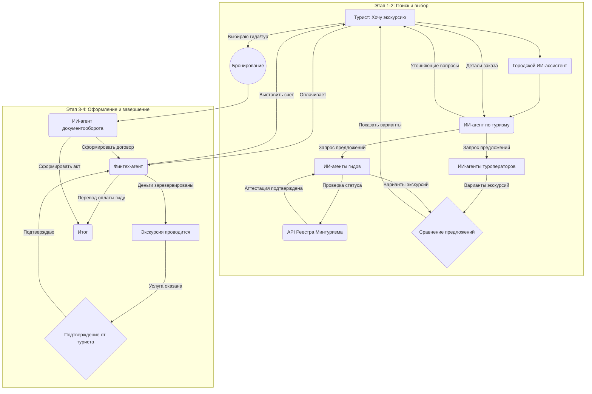

# Сценарий: Подбор экскурсии и аттестованного гида в городском чате

Этот сценарий показывает, как турист или житель города может легко и безопасно организовать экскурсию, а городская система обеспечивает легальность и прозрачность процесса, объединяя заказчиков, туроператоров и аттестованных гидов.

Участники системы:
 * Турист/Заказчик: Инициатор запроса.
 * Городской ИИ-ассистент: Центральный координатор.
 * ИИ-агент по туризму и экскурсиям: Специализированный помощник.
 * ИИ-агенты туроператоров: Представляют штатные предложения компаний.
 * ИИ-агенты аттестованных гидов: Представляют самозанятых (СМЗ) или ИП гидов.
 * ИИ-агент Минтуризма (интеграция с реестром): Проверяет статус аттестации гида.
 * Финтех-агент: Обеспечивает безопасную оплату.
 * ИИ-агент документооборота: Формирует договоры и акты.

## Этап 1: Поиск и формирование заказа

Шаг 1. Начало диалога
Пользователь начинает диалог с общим запросом, не зная конкретных гидов или компаний.
 * Пользователь: Здравствуйте! Мы приехали в Ижевск на выходные, хотим интересную экскурсию по городу для семьи с двумя детьми.
 * Городской ИИ-ассистент: Добрый день! Рад помочь вам познакомиться с Ижевском. Передаю ваш запрос нашему агенту по туризму и экскурсиям.
Шаг 2. Уточнение деталей
Специализированный агент помогает сформировать точный запрос.
 * ИИ-агент по туризму: `Здравствуйте! Чтобы подобрать лучший вариант, уточните, пожалуйста:
   * Какие темы вам интересны: история, оружейное дело, современная архитектура?
   * Какая продолжительность экскурсии предпочтительна?
   * Есть ли пожелания по способу передвижения (пешеходная, на автомобиле)?`
 * Пользователь: Интересует история города, часа на три, пешеходная.

## Этап 2: Подбор и проверка исполнителей

Шаг 3. Агрегация предложений и проверка гидов
Агент рассылает анонимный заказ всем подключенным к системе туроператорам и индивидуальным гидам. Ключевой момент — автоматическая проверка легального статуса.
 * ИИ-агент по туризму: Спасибо! Я отправил ваш запрос проверенным организаторам. Сейчас соберу лучшие предложения.
 * Система (в фоновом режиме):
   * Получает отклики от ИИ-агентов туроператоров и гидов.
   * Для каждого гида, откликнувшегося на заказ, отправляет запрос к реестру Министерства туризма для подтверждения действующей аттестации.
   * Отсеивает предложения от гидов без аттестации.
Шаг 4. Представление вариантов заказчику
Система предоставляет пользователю структурированный список предложений.
 * ИИ-агент по туризму: Вот что удалось найти:
   * От туроператора "Иж-Тур": Экскурсия "Легенды оружейной столицы". Гид — штатный сотрудник. Стоимость: 4500 ₽.
   * От гида Ирины Волковой (ИП, аттестация подтверждена): Авторская экскурсия "Тайны ижевских улочек". Рейтинг: 4.9/5. Стоимость: 4000 ₽.
   * От гида Петра Смирнова (Самозанятый, аттестация подтверждена): Интерактивная экскурсия-квест для детей. Рейтинг: 5.0/5. Стоимость: 5000 ₽.
     Вы можете посмотреть профиль каждого гида и отзывы.

## Этап 3: Безопасное оформление и оплата

Шаг 5. Выбор и бронирование
Пользователь выбирает наиболее подходящий вариант.
 * Пользователь: Выбираю квест от Петра Смирнова.
 * ИИ-агент по туризму: Отличный выбор! Бронирую для вас экскурсию. Для оформления подключаю агентов документооборота и финансов.
Шаг 6. Автоматическое формирование документов и безопасная сделка
Система автоматизирует юридическую и финансовую часть, что особенно важно при работе с самозанятыми и ИП.
 * ИИ-агент документооборота: Здравствуйте! Я подготовил договор на оказание экскурсионных услуг между вами и гидом Петром Смирновым. Пожалуйста, ознакомьтесь. (Появляется ссылка на документ).
 * Финтех-агент: Счет на 5000 ₽ сформирован. Оплата будет зарезервирована и переведена гиду только после того, как вы подтвердите успешное оказание услуги. Пожалуйста, оплатите. (Появляется кнопка "Оплатить").
Этап 4: Проведение экскурсии и завершение
Шаг 7. Координация и напоминания
Система обеспечивает комфортное взаимодействие в день экскурсии.
 * Городской ИИ-ассистент (за день до экскурсии): Напоминаем, завтра в 11:00 у вас запланирована экскурсия с гидом Петром Смирновым. Место встречи: [адрес]. Телефон гида: [номер].
Шаг 8. Подтверждение и расчет
После завершения экскурсии система завершает сделку.
 * Городской ИИ-ассистент (после экскурсии): Надеемся, вам понравилась экскурсия! Пожалуйста, подтвердите, что услуга оказана. (Кнопка "Все прошло отлично").
 * Пользователь: (нажимает кнопку).
 * Финтех-агент: Спасибо! Оплата переведена гиду Петру Смирнову.
 * ИИ-агент документооборота: Акт выполненных работ сформирован и подписан электронно. Документы сохранены в вашем архиве.
 * Городской ИИ-ассистент: Будем рады, если вы оставите отзыв о работе гида. Это поможет другим путешественникам!

