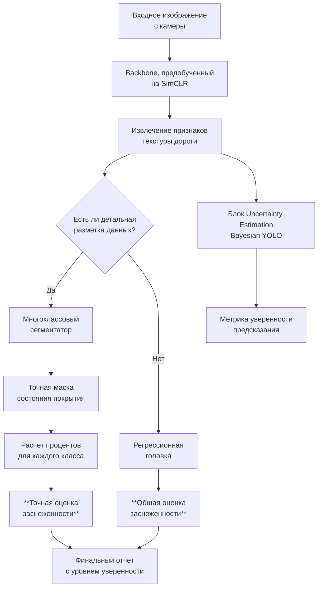

## Определение уровня заснеженности дороги

Материалы

1. [CF-YOLO: Cross Fusion YOLO for Object Detection in Adverse Weather with a High-quality Real Snow Dataset](https://www.researchgate.net/publication/361107308_CF-YOLO_Cross_Fusion_YOLO_for_Object_Detection_in_Adverse_Weather_with_a_High-quality_Real_Snow_Dataset)
2. [An Ultralytics YOLOv8-Based Approach for Road Detection in Snowy
Environments in the Arctic Region of Norway](https://www.researchgate.net/journal/Computers-Materials-Continua-1546-2226/publication/391211888_An_Ultralytics_YOLOv8-Based_Approach_for_Road_Detection_in_Snowy_Environments_in_the_Arctic_Region_of_Norway/links/683426826b5a287c30455a29/An-Ultralytics-YOLOv8-Based-Approach-for-Road-Detection-in-Snowy-Environments-in-the-Arctic-Region-of-Norway.pdf)

### 1. Изменение постановки задачи и разметки данных

Вместо бинарной сегментации "дорога / не дорога" нужно перейти к **сегментации с несколькими классами**, отражающими состояние дорожного покрытия.

**Пример классов для сегментации:**
*   `Чистый асфальт`
*   `Снежная каша (слякоть)`
*   `Ровный снежный накат`
*   `Рыхлый снег`
*   `Гололед`
*   `Снег с обочины` (для контекста)

Такая разметка — это **"золотой стандарт"**, но она требует больших затрат на ручной труд.

### 2. Использование Self-Supervised Learning (SimCLR) для анализа текстуры

Это **ключевое преимущество** данного подхода для вашей задачи.

*   **Как это работает:**
    1.  Модель предварительно обучается на огромном количестве **неразмеченных** изображений заснеженных дорог с помощью SimCLR.
    2.  Она учится различать **текстуры**: гладкий асфальт, зернистую снежную кашу, шероховатый накат, пушистый рыхлый снег.
    3.  Модель формирует "внутреннее представление" о том, как выглядят разные виды снежного покрова, без дорогой ручной разметки.

*   **Выгода:** Модель становится экспертом в различении снежных паттернов, что является основой для оценки уровня заснеженности.

### 3. Модель для оценки заснеженности (2 основных пути)

#### Путь А: Прямая оценка через семантическую сегментацию

Модель, дообученная на данных с многоклассовой разметкой, будет на выходе давать не просто маску дороги, а **карту покрытия**, где каждому пикселю присвоен класс состояния покрытия.

**Как вычислить уровень заснеженности:**
После получения маски сегментации можно легко вычислить **процент покрытия** дороги разными типами снега.

`Уровень_заснеженности = (Площадь_снежного_наката + Площадь_рыхлого_снега) / Общая_площадь_дороги * 100%`

Это дает точную, количественную оценку.

#### Путь Б: Регрессия на основе фич от Self-Supervised модели (Более простой)

Если нет возможности сделать детальную разметку, можно использовать подход, похожий на **расчет SCR (Snow Coverage Rate)** из первой статьи, но на стероидах.

1.  Берем **предобученный с помощью SimCLR backbone** от YOLOv8. Он уже отлично кодирует информацию о текстурах.
2.  **Замораживаем** его веса.
3.  Добавляем сверху несколько полносвязных слоев, которые будут прогнозировать **не категорию, а число** — общий коэффициент заснеженности дороги (от 0 до 1).
4.  **Дообучаем** эту небольшую головку на небольшом наборе данных, где люди вручную проставили оценку заснеженности для каждого изображения (например, "0.1" — почти чисто, "0.9" — полностью завалено).

Этот метод требует гораздо меньше трудозатрат на разметку.

### 4. Применение Uncertainty Estimation для надежности

Метод с **Bayesian YOLO и Monte Carlo Dropout** здесь просто незаменим.

*   **Сценарий:** Модель смотрит на участок дороги в тени. Непонятно: это мокрый асфальт или тонкий слой льда?
*   **Что происходит:** При многократных прогонах модель будет "колебаться" в своих предсказаниях для этих пикселей.
*   **Результат:** Система выдаст не только оценку заснеженности (например, 60%), но и **метрику уверенности** (например, "низкая уверенность").
*   **Польза:** Дорожные службы будут знать, что в этой точке нужна проверка датчиками другого типа или визуальный осмотр. Это предотвращает ошибки из-за бликов, теней и сложных условий.

### Практический пайплайн оценки заснеженности

### Итог: Почему этот подход идеален для оценки заснеженности?

1.  **Высокая точность:** Основан на понимании *текстур*, а не просто цвета. Модель отличает лед от асфальта, рыхлый снег от укатанного.
2.  **Экономичность:** Self-Supervised Learning резко снижает потребность в размеченных данных.
3.  **Надежность:** Uncertainty Estimation предупреждает о сложных для анализа участках, где возможна ошибка.
4.  **Гибкость:** Можно настроить под разные нужды — от общей оценки до детальной карты распределения типов снежного покрова.

Это не просто "есть снег / нет снега", а **квалифицированная диагностика состояния дорожного полотна** на основе компьютерного зрения.
